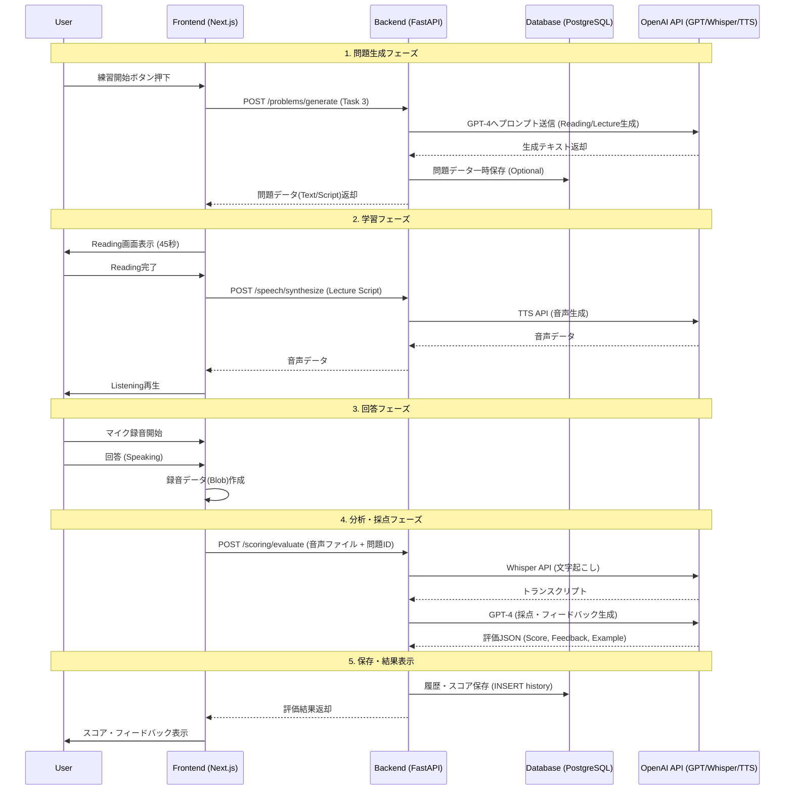

# Rislingo アプリケーション仕様書 (2025-12-15版)

## 1. 処理フロー図

### 1.1 処理フロー図の説明
ユーザーがTOEFL iBT Speaking Task 3の練習を開始してから、AIによるフィードバックを受け取るまでの流れです。

1.  **問題生成フェーズ**:
    *   ユーザーが練習開始を選択すると、フロントエンドはバックエンド経由でOpenAI APIを呼び出します。
    *   AIが「Reading用テキスト」と「Listening用スクリプト（講義内容）」を動的に生成します。
2.  **学習（インプット）フェーズ**:
    *   **Reading**: 画面にReadingテキストが表示され、ユーザーは制限時間内に読みます。
    *   **Listening**: 講義の音声（OpenAI TTSで生成、またはテキスト読み上げ）が再生され、ユーザーは聴取します。
3.  **回答（アウトプット）フェーズ**:
    *   **Speaking**: ユーザーがマイクに向かって回答を録音します。
    *   音声データはフロントエンドでBlob化され、バックエンドへ送信されます。
4.  **分析・採点フェーズ**:
    *   バックエンドは受け取った音声をOpenAI Whisper APIで**文字起こし（Transcribe）**します。
    *   文字起こしテキスト、元のReading/Listening内容、採点基準をセットにしてOpenAI GPT-4へ送信し、**採点（Scoring）**を行います。
5.  **フィードバック・保存フェーズ**:
    *   採点結果（スコア、改善点、模範解答）がフロントエンドに返却・表示されます。
    *   結果はデータベース（PostgreSQL）に保存され、履歴画面や復習（フラッシュカード）で利用可能になります。

### 1.2 処理フロー図 (Mermaid記法)



## 2. 要件定義書

### 2.1 システム概要
TOEFL iBT Speaking Task 3（Reading & Listening & Speaking）の模擬練習を行い、AIによる即時採点とフィードバックを提供するWebアプリケーション。

### 2.2 機能要件

| カテゴリ | 機能名 | 詳細 | 優先度 |
| :--- | :--- | :--- | :--- |
| **認証** | ユーザー登録・ログイン | メールアドレス/パスワードによる認証。JWTトークン発行。 | 高 |
| **練習** | 問題自動生成 | トピックを指定またはランダムで、Reading/ListeningテキストをAI生成する。 | 高 |
| | Reading機能 | 制限時間（45秒等）のタイマー付きテキスト表示。 | 高 |
| | Listening機能 | 講義スクリプトの音声再生（AI音声合成）。 | 高 |
| | 録音機能 | ブラウザ上での音声録音（60秒）。波形表示。 | 高 |
| **評価** | AI文字起こし | 録音データをテキスト化する (Whisper)。 | 高 |
| | AI採点 | TOEFL採点基準に基づきスコア(0-4)算出、改善点指摘、模範解答生成。 | 高 |
| **復習** | 学習履歴 | 過去の練習結果（音声、スコア、フィードバック）の一覧・詳細表示。 | 中 |
| | フレーズ保存 | 模範解答や改善点から有用な表現を保存する（フラッシュカード）。 | 中 |
| | フラッシュカード | 保存したフレーズの暗記練習モード。 | 低 |

### 2.3 非機能要件
*   **レスポンス**: 採点処理は非同期または待機画面を表示し、ユーザーに進行状況を伝える（AI処理に時間がかかるため）。
*   **データ保存**: 音声データ、生成された問題、採点結果を永続化する。
*   **UI/UX**: PCおよびタブレットでの利用を想定したレスポンシブデザイン。
*   **インフラ**: Azure Web App (Backend) + Azure Static Web Apps (Frontend) + Azure Database for PostgreSQL (Neon)。

## 3. コードリーディングレポート

### 3.1 Next.js と FastAPI のエンドポイント対応表

| 画面 / 操作 | Frontend Path / Component | Backend API Endpoint | HTTP Method | 役割 |
| :--- | :--- | :--- | :--- | :--- |
| **ログイン** | `/login` | `/auth/token` | `POST` | 認証、アクセストークン取得 |
| **サインアップ** | `/login` (Tab) | `/auth/signup` | `POST` | 新規ユーザー作成 |
| **問題生成** | `/practice/reading` (useEffect) | `/problems/generate` | `POST` | AIによる問題(Task 3)生成 |
| **音声合成** | `/practice/listening` | `/speech/tts` | `POST` | テキストを音声に変換(OpenAI TTS) |
| **採点実行** | `/practice/results` | `/scoring/evaluate` | `POST` | 音声アップロード、文字起こし、採点 |
| **履歴一覧** | `/history` | `/history/` | `GET` | 過去の練習セッション取得 |
| **履歴詳細** | `/history/[id]` | `/history/{id}` | `GET` | 特定のセッション詳細取得 |
| **フレーズ保存**| `FlashCard.tsx` (Saveボタン) | `/phrases/` | `POST` | フレーズをDBに保存 |
| **フレーズ一覧**| `/flashcards` | `/phrases/` | `GET` | 保存済みフレーズ取得 |

### 3.2 各ファイルの役割

#### Backend (`backend/`)
*   **`main.py`**: アプリケーションのエントリーポイント。CORS設定やルーターの統合を行う。
*   **`database.py`**: SQLAlchemyを使用したデータベース接続設定。
*   **`models.py`**: データベースのテーブル定義（Users, PracticeSessions, SavedPhrasesなど）。
*   **`routers/`**: APIのエンドポイント定義。
    *   `auth.py`: 認証関連（ログイン、登録）。
    *   `problems.py`: 問題生成ロジックのハンドリング。
    *   `scoring.py`: 採点プロセスのオーケストレーション（音声保存→文字起こし→GPT評価）。
    *   `speech.py`: 音声関連（TTS, 文字起こし単体テスト用など）。
    *   `phrases.py`: フレーズ保存・取得のCRUD。
*   **`services/`**: ビジネスロジック。
    *   `openai_client.py`: OpenAI API（GPT, Whisper, TTS）との通信をラップするクラス。
    *   `scoring_service.py`: 採点プロンプトの構築、JSONパースなどの詳細ロジック。

#### Frontend (`frontend/`)
*   **`app/`**: Next.js App Routerのページ定義。
    *   `practice/`: 練習モードの各ステップ（`reading`, `listening`, `speaking`, `results`）ごとのページ。
    *   `history/`: 履歴確認ページ。
    *   `flashcards/`: 単語帳ページ。
*   **`components/`**: 再利用可能なUI部品。
    *   `AudioRecorder.tsx`: `MediaRecorder` APIを使用した録音機能と波形表示。
    *   `ScoreDisplay.tsx`: スコア結果の可視化コンポーネント。
*   **`lib/`**: ユーティリティ関数。APIクライアントの設定など。

## 4. API仕様書 (簡易版)

### Auth (認証)
*   **POST /auth/signup**
    *   概要: ユーザー登録
    *   Body: `{ "email": "...", "password": "..." }`
    *   Response: User Object
*   **POST /auth/token**
    *   概要: ログイン（トークン発行）
    *   Body: `OAuth2PasswordRequestForm` (username=email, password)
    *   Response: `{ "access_token": "...", "token_type": "bearer" }`

### Problems (問題)
*   **POST /problems/generate**
    *   概要: Task 3の問題（Reading, Lecture）を生成
    *   Auth: Required
    *   Body: `{ "topic": "Biology" (optional) }`
    *   Response: `{ "reading_text": "...", "lecture_script": "...", "topic": "..." }`

### Speech (音声)
*   **POST /speech/tts**
    *   概要: テキスト読み上げ
    *   Auth: Required
    *   Body: `{ "text": "..." }`
    *   Response: Audio Stream (audio/mpeg)

### Scoring (採点)
*   **POST /scoring/evaluate**
    *   概要: 録音データを送信し、文字起こしと採点を行う（メイン機能）
    *   Auth: Required
    *   Body (Multipart):
        *   `audio_file`: (Binary .webm/.wav)
        *   `problem_data`: (JSON string of reading/lecture info)
    *   Response:
        ```json
        {
          "transcription": "I think the student agrees...",
          "scores": { "delivery": 3.5, "language_use": 3.0, "topic_development": 4.0, "total": 3.5 },
          "feedback": { "strengths": ["..."], "improvements": ["..."] },
          "sample_response": "..."
        }
        ```

### History (履歴)
*   **GET /history/**
    *   概要: ユーザーの練習履歴一覧を取得
    *   Auth: Required
    *   Response: List of Sessions

### Phrases (フレーズ)
*   **POST /phrases/**
    *   概要: フレーズを保存
    *   Body: `{ "phrase": "...", "meaning": "...", "source": "Sample Answer" }`
*   **GET /phrases/**
    *   概要: 保存済みフレーズ取得
